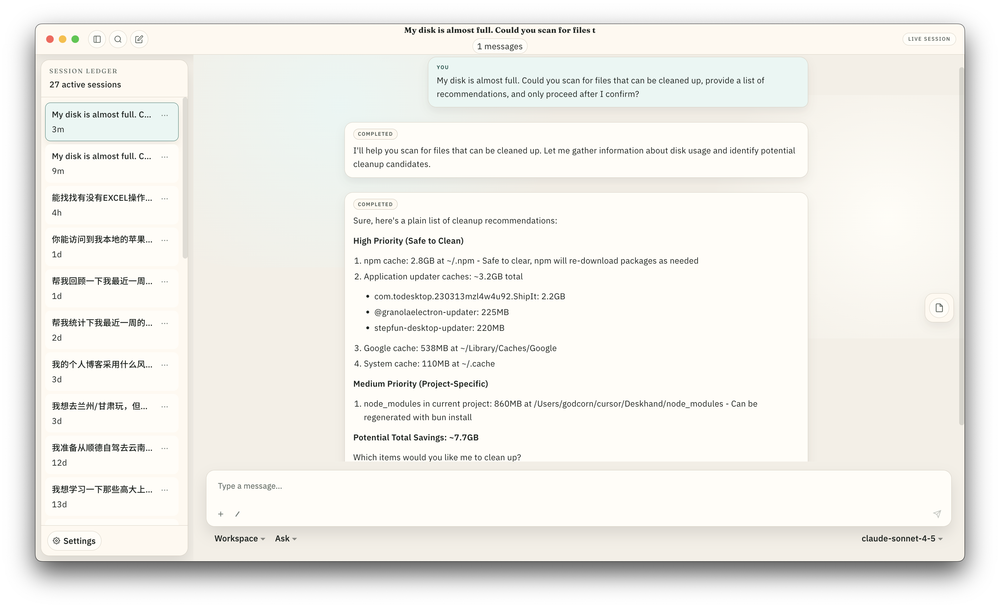
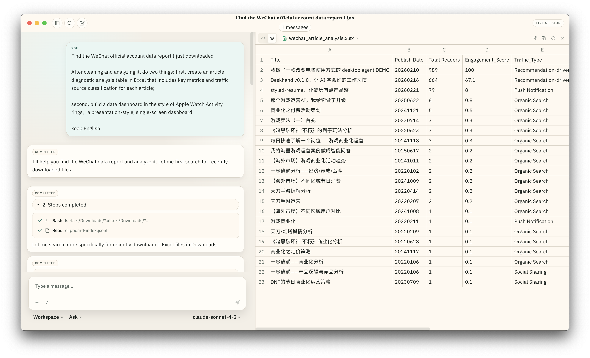
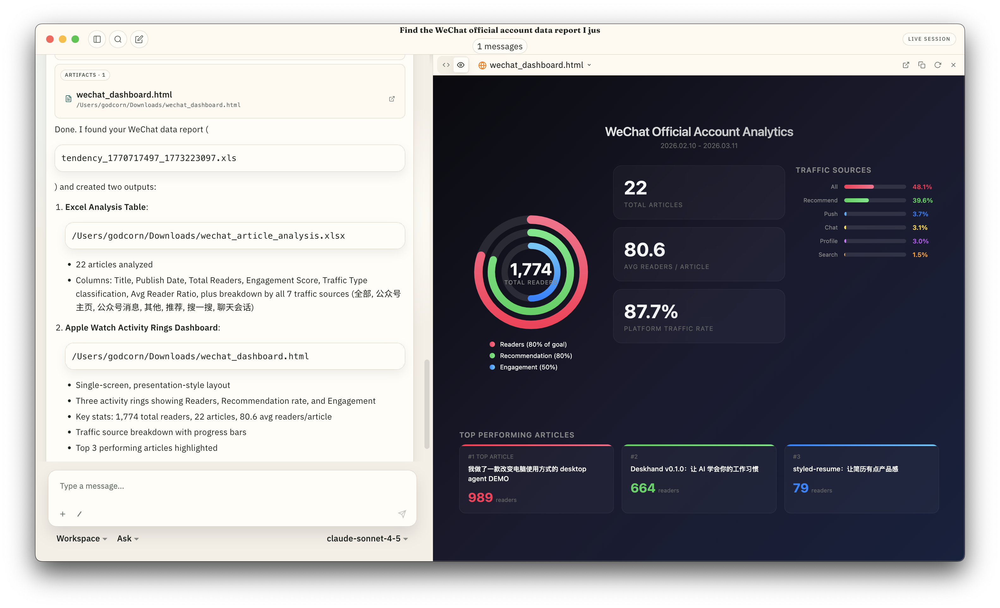
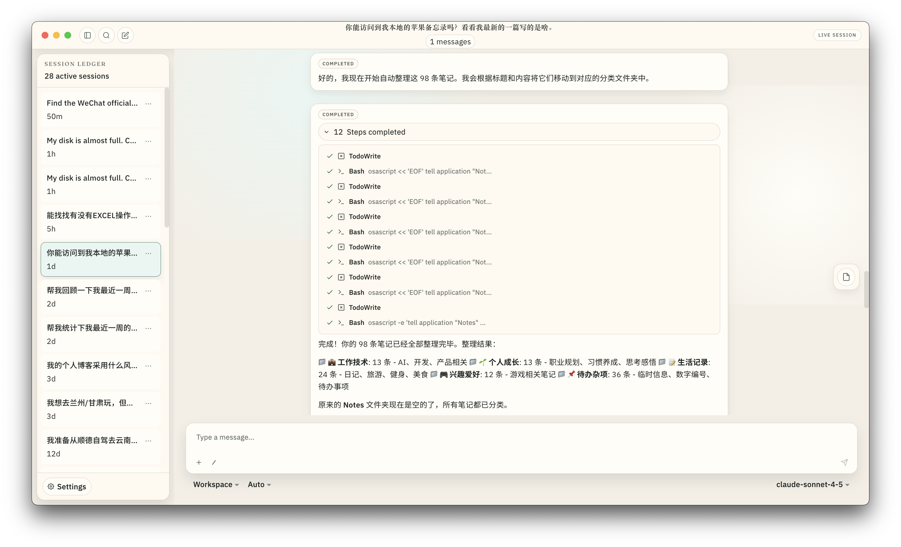
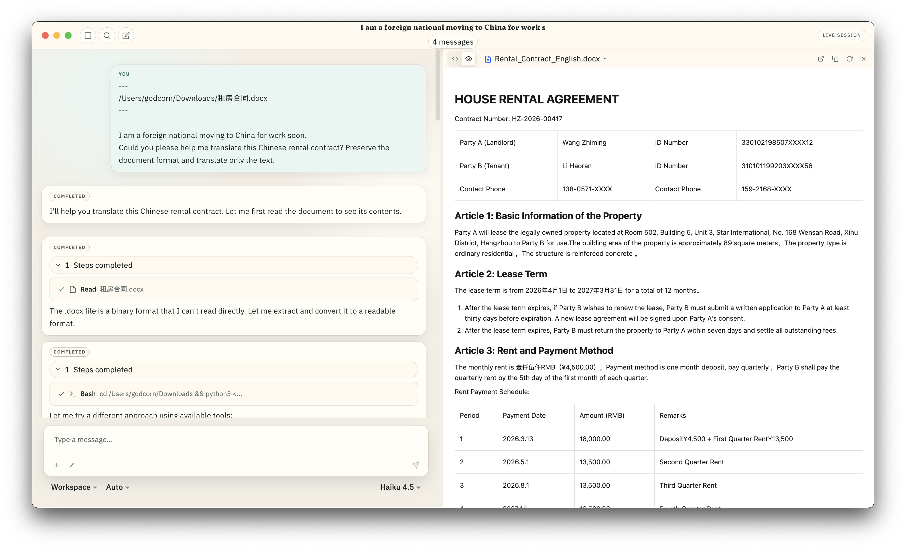
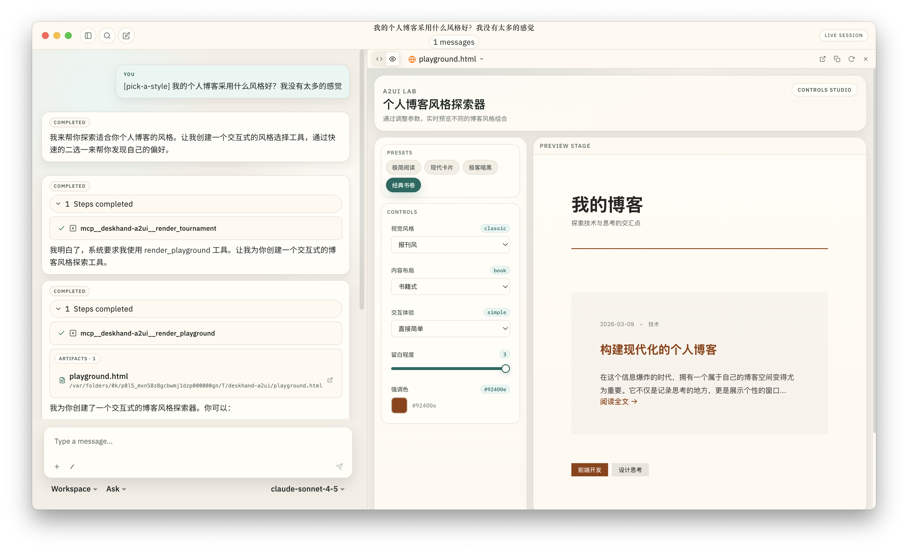
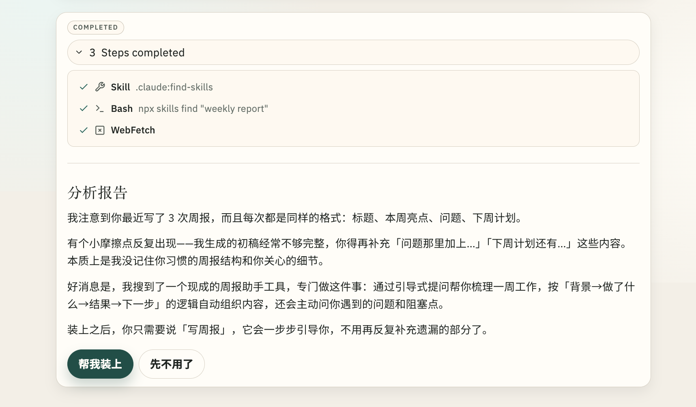
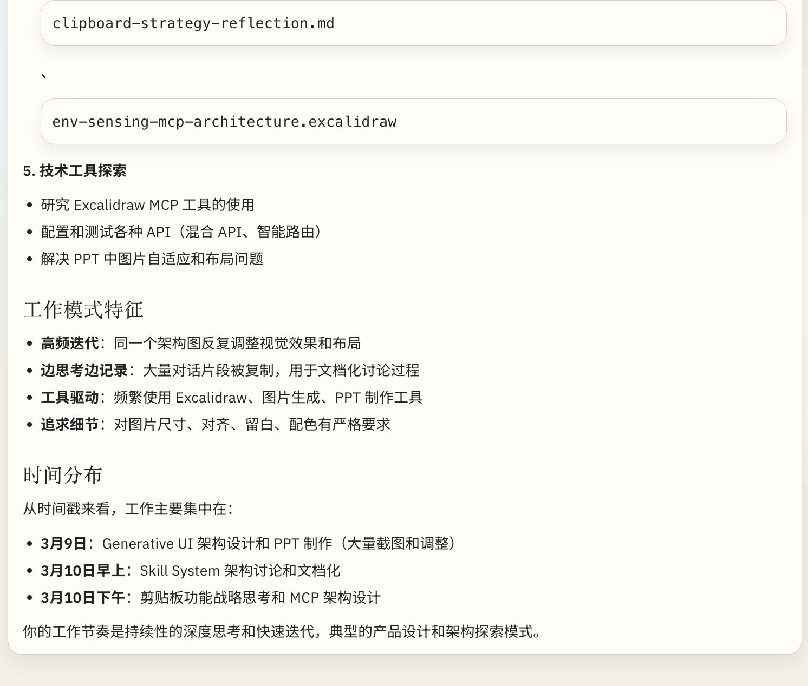
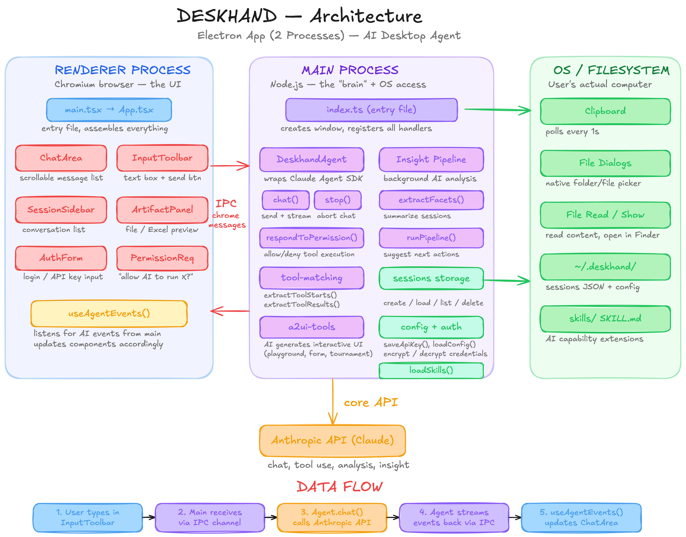

<p align="center">
  <h1 align="center">Deskhand</h1>
  <p align="center">
    An AI desktop agent that reads your local context and invokes tools<br/>
    to help non-technical users — and everyone else — get things done.
  </p>
</p>

<p align="center">
  
  
  
  
  
</p>

<p align="center">
  <a href="https://yuhao-corn.github.io/deskhand-showcase/">Product Showcase</a> · <a href="https://yuhao-corn.github.io/column/">Builder's QA Column</a>
</p>

---

## What It Can Do

<!-- 1. Disk Cleanup — Desktop-exclusive: scan disk, suggest cleanup, execute with permission -->
<p align="center">
  
</p>
<p align="center"><em>Scan disk usage, suggest cleanup targets, and execute only after your confirmation.</em></p>

<br/>

<!-- 2. Excel Analysis — Turn raw data into structured analysis -->
<p align="center">
  
</p>
<p align="center"><em>Find local data files, analyze them, and produce a structured Excel report.</em></p>

<br/>

<!-- 3. HTML Dashboard — Visualize the same data as an interactive dashboard -->
<p align="center">
  
</p>
<p align="center"><em>Then turn that analysis into a visual HTML dashboard — in the same conversation.</em></p>

<br/>

<!-- 4. Notes Classification — Organize and isolate sensitive content -->
<p align="center">
  
</p>
<p align="center"><em>Classify Apple Notes by topic and isolate entries containing sensitive information.</em></p>

<br/>

<!-- 5. Document Translation — Read, translate, and render .docx files -->
<p align="center">
  
</p>
<p align="center"><em>Read a local .docx file, translate it, and render the result with full formatting.</em></p>

---

## Features

### Generative UI

AI-generated interactive components for structured input — Playground for style exploration with live preview, Tournament for preference discovery through binary choices, and Guided Form for step-by-step information collection.

<p align="center">
  
</p>

### Skill Insight

Analyzes your usage patterns, identifies friction points, and recommends skills to install — one click to activate.

<p align="center">
  
</p>

### Clipboard Intelligence

Background clipboard monitoring gives the AI awareness of your working context. Ask it to summarize your week and it already knows what you've been doing.

<p align="center">
  
</p>

### More

- **Permission System** — Ask mode requires confirmation for file operations; Allow-All mode for trusted workflows
- **Session Management** — Persistent conversations with lazy loading, rename, archive, delete
- **Artifact Panel** — Preview HTML, Excel, Word, and code in a side panel
- **Activity Tree** — Visual step-by-step display of tool execution progress

---

## Architecture

<p align="center">
  
</p>

| Layer | Technology |
|-------|-----------|
| Runtime | Electron 33, Node.js |
| UI | React 18, TailwindCSS 4, Radix UI |
| State | Jotai |
| AI | Claude Agent SDK, Anthropic SDK, MCP SDK |
| Build | Vite 6, esbuild, TypeScript 5 |
| Storage | JSONL (append-only) |

---

## Quick Start

Prerequisites: [Git](https://git-scm.com/) and [Bun](https://bun.sh/) (v1.0+).

```bash
git clone https://github.com/xxx/Deskhand.git
cd Deskhand
bun install
cp .env.example .env
```

Add your API key to `.env`:

```env
ANTHROPIC_API_KEY=sk-ant-xxx   # Get one at https://console.anthropic.com/
```

Then start the app:

```bash
bun run electron:dev
```

<details>
<summary>Optional configuration</summary>

| Variable | Description |
|----------|-------------|
| `ANTHROPIC_BASE_URL` | Custom API endpoint (e.g. OpenRouter) |
| `ANTHROPIC_MODEL` | Override the default model |

</details>

---

## Contributing

Contributions are welcome. Feel free to open an issue or submit a pull request.

## License

[MIT](LICENSE)

## Acknowledgments

Built with [Claude Agent SDK](https://github.com/anthropics/claude-agent-sdk) and [Anthropic SDK](https://github.com/anthropics/anthropic-sdk-node).
