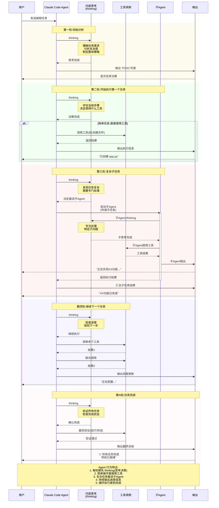

# Chat 界面设计原理

## 核心逻辑

```
Claude 工作模式 → SSE 事件流 → 事件类型字段 → UI 渲染
```

---

## Claude Code Agent 行为模式时序图

### Agent 工作流程可视化



### Claude Code Agent 核心行为模式

#### 1. Thinking (思考阶段)
每一轮执行开始前，Agent 都会进入思考阶段：
- 分析当前任务状态
- 评估任务复杂度
- 决定使用什么策略（直接工具 vs 子Agent）
- 规划下一步行动

#### 2. 工具调用 (Tool Usage)
对于简单、明确的操作，Agent 直接使用工具：
- 文件操作（创建、编辑、删除）
- 命令执行（运行脚本、测试）
- 代码分析
- 搜索查询

#### 3. 子Agent 委派 (Sub-Agent Delegation)
遇到复杂子任务时，Agent 会启动子Agent：
- 子Agent 有自己独立的思考过程
- 子Agent 可以使用工具
- 子Agent 完成后返回结果给主Agent
- 实现任务的模块化处理

#### 4. 输出机制 (Output)
Agent 会持续向用户输出信息：
- **TODO 列表** - 任务开始时的计划分解
- **进度信息** - 执行过程中的状态更新
- **执行结果** - 每个步骤的完成情况
- **最终总结** - 任务完成的汇总报告

#### 5. 循环迭代 (Iterative Loop)
整个过程是一个循环：
```
思考 → 决策 → 执行(工具/子Agent) → 输出 → 思考 → ...
```

### 典型执行流程示例

#### 场景：创建一个 Web 应用

***第一轮*** - 初始分析
- Thinking: 理解需求，分解任务
- Output: TODO 列表
  1. 创建项目结构
  2. 实现后端 API
  3. 实现前端界面
  4. 配置部署

***第二轮*** - 创建项目结构
- Thinking: 决定直接使用工具
- Tool: 创建目录和基础文件
- Output: "已创建项目结构"

***第三轮*** - 实现后端 API
- Thinking: 任务复杂，启动子Agent
- Sub-Agent: 独立处理 API 实现
  - 子Agent thinking
  - 子Agent 使用工具编写代码
  - 子Agent 输出进度
- Output: "后端 API 已完成"

***第四轮*** - 实现前端界面
- Thinking: 继续下一个任务
- Tool: 创建前端文件
- Tool: 编写组件代码
- Output: "前端界面开发中..."

***最后一轮*** - 完成验证
- Thinking: 检查所有任务
- Tool: 运行测试
- Output: "✓ 所有任务完成，项目已就绪"

### 为什么这样设计？

1. **思考先行** - 确保每步都经过深思熟虑
2. **灵活执行** - 根据任务复杂度选择合适的执行方式
3. **模块化** - 子Agent 处理独立任务，提高效率
4. **透明度** - 持续输出让用户了解进度
5. **自适应** - 根据执行结果动态调整策略

---

## 我们界面收到哪些需要渲染的信息？

---

## 3. 各事件类型的 UI 渲染方式

### 响应前

- Thinking（动画+文本+读秒）

### 响应中
- Turn card
    - Activity（写出事件数量，注名 list all files and fonders in downloads with details）
        1.[执行结果icon]message
        2.[执行结果icon]tool use
        3.[执行结果icon]tool use
        4.subagent use
            - [执行结果icon]tool use from subagent
        - Thinking（动画+文本+读秒）
        
    > 卡片里的顺序由实际返回顺序决定，使用编号标识
    - churning（动画+文本+读秒）

### 返回结束
- Turn card
    - Activity（写出事件数量，注名 list all files and fonders in downloads with details）
        1.[执行结果icon]message
        2.[执行结果icon]tool use
        3.[执行结果icon]tool use
        4.subagent use
            - [执行结果icon]subagent tool use
        ...
        N.[执行结果icon]tool use
    > 卡片里的顺序由实际返回顺序决定，使用编号标识
    - ResponseCard

